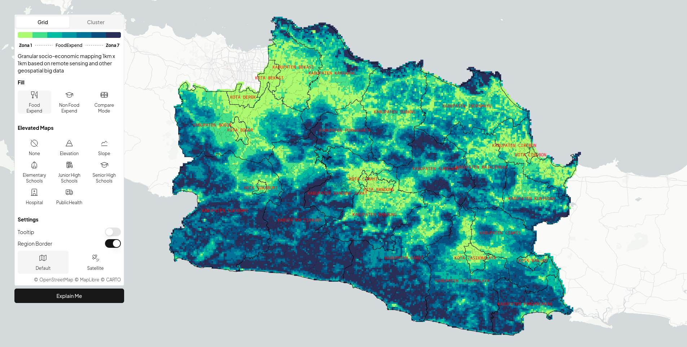
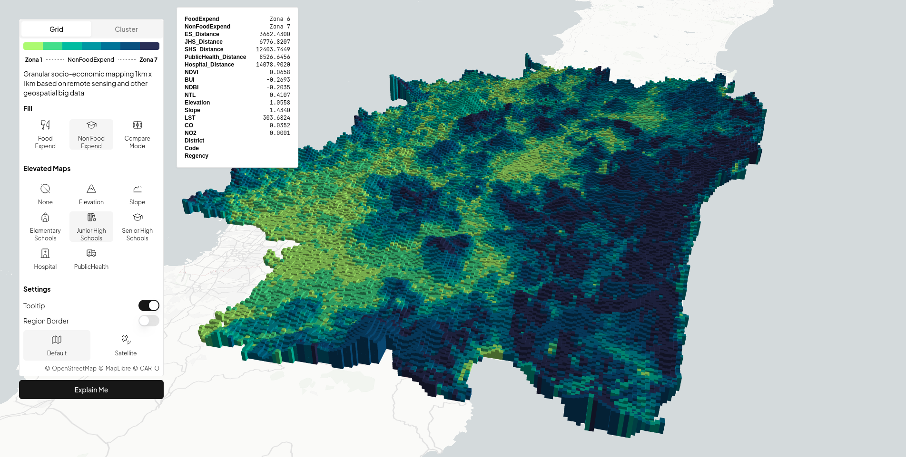
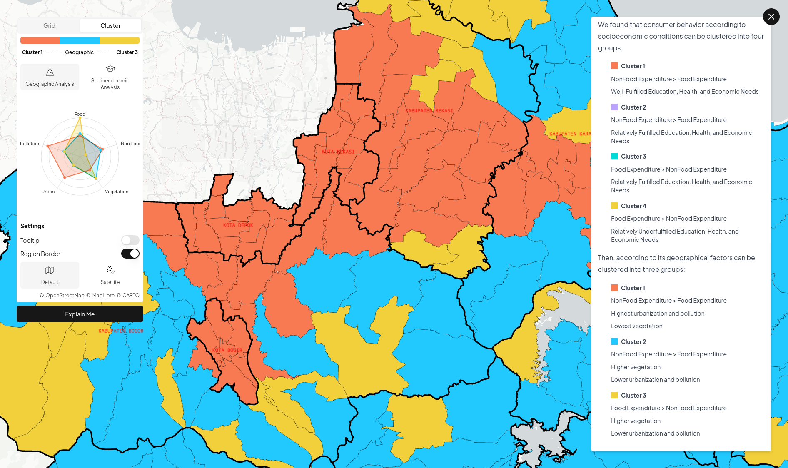

# Granular Socio-Economic Mapping

Social economics is primarily concerned with the interplay between social processes and economic activity within a society. Social economics may attempt to explain how a particular social group or socioeconomic class behaves within a society, including their actions as consumers. According to BPS Statistics Indonesia, low socio-economic fulfillment indicates poverty. Thus, socioeconomic data is important to read market needs to maximize sales. On the other hand, this data is also needed to show the incidence of poverty. However, traditional data collecting implies that socioeconomic data is only presented at the district level and updated once a year. This research aims to develop the granular socio-economic mapping based on remote sensing and other geospatial big data and present it in the form of a website-based dashboard enriched by insight into consumer behavior modeling and consumer behavior geographical factor analysis. This approach allows for presenting more granular socioeconomic data in terms of coverage and time at a cheaper cost and faster rate. To overcome this, we integrate multisource remote sensing satellite imagery and other geospatial big data by implementing artificial intelligence-machine learning and statistical analysis. The novelty of this research is the innovative advancement of remote sensing technology to improve market business strategy and poverty alleviation insights at the same time.​

This research aims to **integrate the potential of multisource remote sensing and other geospatial big data to predict the socio-economic conditions of granular areas**​. The main objective is then broken down into the following sub-objectives:​

1. **What socioeconomic conditions exist in each granular area?** we developed Granular socio-economic mapping with machine learning modelling and 1 km granular socio-economic mapping as the output.​
2. **What is consumer behaviour in certain area?** we developed consumer behaviour modeling with the mapping as the output.​
3. **What are the specific geospatial factors that contribute to the differences in socio-economic conditions across areas?** we analysed consumer behaviour geographical factor ​
4. **How to present insights for decision making and commercial needs?** we developed Website-based dashboard for non-technical users.

## Multisource Remote Sensing and Other Geospatial Big Data Approach​

We focus on three socioeconomic dimensions those are: economic activity, education, and health. The multisource remote sensing and other geospatial big data that we used are listed below.​

| Dimension         | Data                                            | Description                                                      | Data Source   | Spatial Resolution | Temporal Resolution | Data Preprocessing                                                                      |
| ----------------- | ----------------------------------------------- | ---------------------------------------------------------------- | ------------- | ------------------ | ------------------- | --------------------------------------------------------------------------------------- |
| Economic Activity | Night Time Light Intensity (NTL)                | Detection of economic activity                                   | NOAA-VIIRS    | 500 m              | 1 month             | Median Reducing > Zonal Statistics                                                      |
|                   | Built-Up Index (BUI)                            | Urban areas detection based on building distribution             | Sentinel-2    | 10 m               | 5 days              | Cloud Selection > Cloud Masking > Band Compositing > Median Reducing > Zonal Statistics |
|                   | Normalized Difference Vegetation Index (NDVI)   | Detection of rural areas based on vegetation density             | Sentinel-2    | 10 m               | 5 days              | Cloud Selection > Cloud Masking > Band Compositing > Median Reducing > Zonal Statistics |
|                   | Digital Elevation Model (DEM)                   | Detection of physical condition of the area                      | SRTM          | 30 m               | -                   | Median Reducing > Zonal Statistics                                                      |
|                   | Land Surface Temperature (LST)                  | Urban areas detection based on surface temperature distribution  | MODIS-Terra   | 1000 m             | 4 days              | Cloud Selection > Cloud Masking > Median Reducing > Zonal Statistics                    |
|                   | Carbon Monoxide (CO) and Nitrogen Dioxide (NO2) | Economic activity detection based on the pollution               | Sentinel-5P   | 1113 m             | < 1 day             | Median Reducing > Zonal Statistics                                                      |
|                   | Market Point of Interest (POI)                  | Accessibility and density to economic activity point of interest | OpenStreetMap | -                  | -                   | Google Maps Geospatial Location Scrapping > Distance and Density Calculation            |
| Health            | Healthcare Point of Interest (POI)              | Accessibility and density to healthcare facilities               | OpenStreetMap | -                  | -                   | Google Maps Geospatial Location Scrapping > Distance and Density Calculation            |
| Education         | Education Point of Interest (POI)               | Accessibility and density to education facilities                | OpenStreetMap | -                  | -                   | Google Maps Geospatial Location Scrapping > Distance and Density Calculation            |

## Results

### Granular socio-economic mapping

Our research is capable of mapping socio-economic conditions at a granular level of 1 km. ​This result was obtained from machine learning-based modeling with the following description. ​

1. Expenditure visualizations are displayed in 7 zones, from the highest expenditure zone to the lowest expenditure zone. Also, it can display information such as distance to the nearest school, distance to the nearest healthcare facility, vegetation condition, topography, urban, and pollution. ​
2. In general, the mapping patterns of food and non-food expenditure are similar, though with distinct details.​ 
3. The northern and central of West Java regions tend to be more promising areas. Meanwhile, the southern of West Java region requires government attention.​

### Consumer Behaviour Modelling

To know consumer behaviour, we developed consumer behaviour modeling utilizing artificial Intelligence - Machine Learning Clustering ​

We found that consumer behavior according to socioeconomic conditions can be clustered into four groups:

1. Cluster 1
   
   NonFood Expenditure > Food Expenditure
   
   Well-Fulfilled Education, Health, and Economic Needs

2. Cluster 2
   
   NonFood Expenditure > Food Expenditure
   
   Relatively Fulfilled Education, Health, and Economic Needs

3. Cluster 3
   
   Food Expenditure > NonFood Expenditure
   
   Relatively Fulfilled Education, Health, and Economic Needs

4. Cluster 4
   
   Food Expenditure > NonFood Expenditure
   
   Relatively Underfulfilled Education, Health, and Economic Needs

Then, according to its geographical factors can be clustered into three groups:

1. Cluster 1
   
   NonFood Expenditure > Food Expenditure
   
   Highest urbanization and pollution Lowest vegetation
   
2. Cluster 2
   
   NonFood Expenditure > Food Expenditure
   
   Higher vegetation, Lower urbanization and pollution
3. Cluster 3
   
   Food Expenditure > NonFood Expenditure
   
   Higher vegetation, Lower urbanization and pollution

## Website Development

### Development

This prototype built with Single Page Application (SPA) arcticheture, **no server, no dynamic data, and only serve static files**, using some libraries:

1. [react](https://react.dev/)
2. [maplibre](https://maplibre.org/)
3. [react-map-gl](https://visgl.github.io/react-map-gl/)
4. [deck.gl](https://deck.gl/)
5. [parquet-wasm](https://github.com/kylebarron/parquet-wasm)

To run this project, just

1. clone the project
2. `pnpm install`
3. `pnpm run start`

### Challange

The challange to create this website is to serve big geospatial dataset (granular mapping grid 1kmx1km). This data can be big if we are using standard format like geojson, geopackage, or geobuff, so we compress the data with parquet and directly visualize the data with deck.gl, a highly performant large-scale data visualizations. with this method, we can save up to 50% file size.

### Basemaps

Basemap in this project is from modified version from cartodb positron and esri satellite in [mapbox style](https://docs.mapbox.com/style-spec/guides/). 